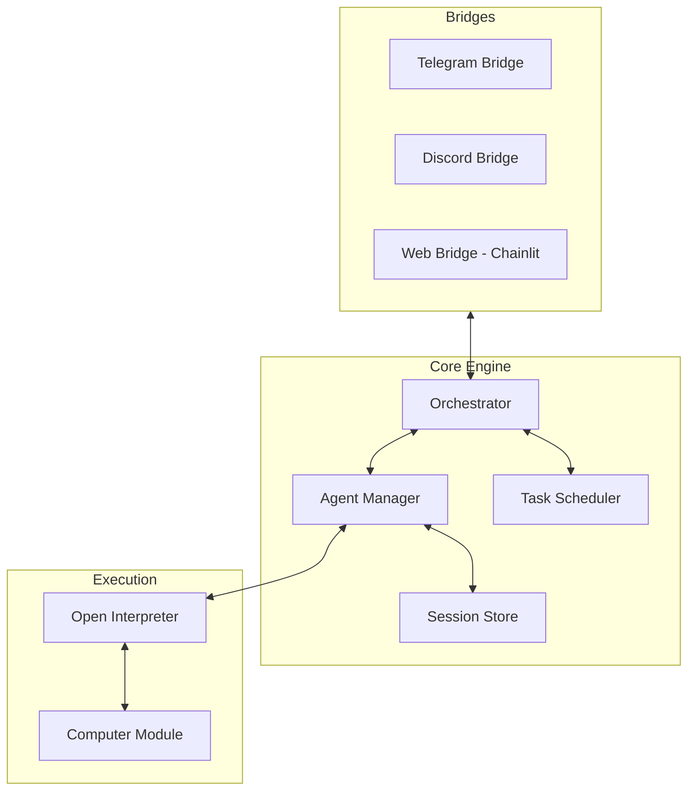

# Architecture Patterns: IronClaw Agent System

**Domain:** Self-hosted AI Agent System
**Researched:** 2026-02-24
**Confidence:** HIGH

## Recommended Architecture

IronClaw follows a **Centralized Orchestrator** pattern where a core engine manages multiple "Bridges" (interfaces) and a pool of "Agent Sessions".

### Conceptual Diagram



### Component Boundaries

| Component | Responsibility | Communicates With |
|-----------|---------------|-------------------|
| **Orchestrator** | Central message routing, bridge management, and event dispatching. | Bridges, Agent Manager, Task Scheduler |
| **Bridges** | Platform-specific I/O (Telegram, Discord, Web). Translates native messages to IronClaw Events. | Orchestrator |
| **Agent Manager** | Manages life-cycle of `OpenInterpreter` instances. Handles session creation/recovery. | Orchestrator, Open Interpreter, Session Store |
| **Session Store** | Persistence layer for conversation history and user preferences. | Agent Manager |
| **Execution Layer** | The host system or Docker container where code actually runs. | Open Interpreter (Computer Module) |

### Data Flow

1.  **Ingress:** A User sends a message via Telegram. The `Telegram Bridge` captures it and sends a `UserMessageEvent` to the `Orchestrator`.
2.  **Context Recovery:** The `Orchestrator` asks the `Agent Manager` for the session associated with that User ID. The `Agent Manager` loads history from the `Session Store` and initializes/retrieves an `OpenInterpreter` instance.
3.  **Processing:** The `Orchestrator` calls `agent.chat(message, stream=True)`.
4.  **Streaming Egress:** As `OpenInterpreter` generates chunks (thoughts, code, or output), the `Agent Manager` emits `StreamEvent`s back to the `Orchestrator`.
5.  **Bridge Update:** The `Orchestrator` routes these chunks to the active `Bridge` (Telegram), which updates the UI in real-time.
6.  **Tool/System Execution:** If code is executed, the `Computer Module` interacts with the host. Results are fed back into the agent's context.
7.  **Finalization:** Once the turn is complete, the `Session Store` updates the persistent record.

## Patterns to Follow

### Pattern 1: Async Generator Streaming
**What:** Use Python's `async for` to consume chunks from `interpreter.chat`.
**When:** Always, to ensure the UI remains responsive and provides immediate feedback.
**Example:**
```python
async def process_message(user_id, text):
    async for chunk in agent_manager.get_agent(user_id).chat(text, stream=True):
        await orchestrator.dispatch_chunk(user_id, chunk)
```

### Pattern 2: Bridge-Agnostic Core
**What:** The `Orchestrator` and `Agent Manager` should never import bridge-specific libraries (like `discord.py`). 
**When:** To maintain separation of concerns and allow adding new bridges (e.g., WhatsApp, Slack) easily.

### Pattern 3: Capability Injection
**What:** Inject a custom `ironclaw` module or toolset into the interpreter.
**When:** To allow the agent to perform system-level actions that require IronClaw's knowledge (e.g., "Notify me on Telegram when this is done").
**Example:**
```python
def notify_user(msg):
    orchestrator.notify(current_user, msg)

interpreter.computer.tools.append(notify_user)
```

## Anti-Patterns to Avoid

### Anti-Pattern 1: The "Everything-in-Main" script
**What:** Putting bot listeners, interpreter config, and business logic in one file.
**Why bad:** Makes it impossible to test components in isolation and leads to threading/async conflicts.
**Instead:** Use a modular approach with a central `Core` package and separate `Bridges` modules.

### Anti-Pattern 2: Stateless Sessions
**What:** Creating a new `OpenInterpreter` instance for every message without history.
**Why bad:** The agent loses context, forgetting previous instructions or variables.
**Instead:** Map `user_id` to a persistent session and restore `interpreter.messages` on every interaction.

## Scalability Considerations

| Concern | At 1-5 users | At 100 users | At 1000 users |
|---------|--------------|--------------|---------------|
| **Memory** | Low (few Python objects) | Moderate (Interpreter instances grow) | High (Need to offload idle sessions to disk) |
| **CPU** | Minimal | Significant (Code execution spikes) | Very High (Need worker nodes/containers) |
| **Storage** | Negligible (JSON files) | Moderate | High (DB recommended over flat files) |

## Build Order & Dependencies

1.  **Agent Manager:** Wraps `open-interpreter`. Validates basic "Input -> Code -> Output" loop.
2.  **Web Bridge (Chainlit):** Provides a visual dashboard for debugging the streaming logic.
3.  **Session Store:** Adds persistence so conversations survive restarts.
4.  **Messaging Bridges (Telegram/Discord):** Adds external access points.
5.  **Job Scheduler/Proactive:** Allows the agent to run long tasks and "call back" to the user.

## Sources

- [Open Interpreter Python API Docs](https://docs.openinterpreter.com/python-interface/introduction)
- [Chainlit Architecture Guide](https://docs.chainlit.io/concepts/overview)
- [Telegram Bot API Best Practices](https://core.telegram.org/bots/api)
- [Multi-Agent Systems with Routing Patterns (LangChain Blog)](https://blog.langchain.dev/multi-agent-workflows/)
