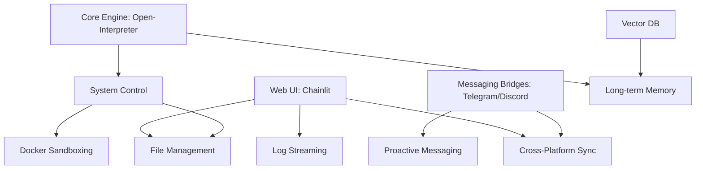

# Feature Landscape: IronClaw Agent System

**Domain:** Self-hosted AI Agent System
**Researched:** 2025-02-23
**Overall Confidence:** HIGH

## Table Stakes

Features users expect in any modern AI agent platform. Missing these makes the system feel like a toy.

| Feature | Why Expected | Complexity | Notes |
|---------|--------------|------------|-------|
| **Interactive Chat UI** | Primary interface for LLM interaction. | Low | Using Chainlit provides this out-of-the-box. |
| **Tool Use / Function Calling** | Ability to interact with external tools or APIs. | Medium | Core to `open-interpreter`. |
| **Basic File Management** | Uploading/downloading files for the agent to process. | Medium | Essential for "System Control". |
| **Execution Logging** | Visibility into what the agent is doing (code execution, errors). | Low | Chainlit handles streaming logs well. |
| **Simple Authentication** | Protecting a self-hosted instance from unauthorized access. | Low | Necessary for any web-exposed service. |
| **Short-term Memory** | Context retention within a single conversation session. | Low | Standard LLM window management. |
| **Human-in-the-loop** | Approval mechanism for risky actions (e.g., `rm -rf`). | Medium | `open-interpreter` has an interactive mode for this. |

## Differentiators

Features that set IronClaw apart from generic chatbots or restricted cloud agents.

| Feature | Value Proposition | Complexity | Notes |
|---------|-------------------|------------|-------|
| **Deep System Control** | Executing shell commands, Python scripts, and managing the OS directly. | High | Leveraging `open-interpreter` to its full extent. |
| **Multi-Platform Bridge** | Control the agent via Telegram and Discord, not just a web dashboard. | Medium | Allows "Agent-on-the-go" usage. |
| **Proactive Messaging** | Agent initiates contact (e.g., "Task finished", "System load high"). | High | Requires a background task scheduler and state monitoring. |
| **Cross-Platform Sync** | Resuming a Telegram conversation on the Web UI seamlessly. | High | Requires robust session/context management. |
| **Docker Sandboxing** | Running agent code in an isolated container for security. | High | Critical for safely executing AI-generated shell commands. |
| **Local Model Support** | Integration with Ollama/LocalAI for 100% private execution. | Medium | Appeals to the privacy-conscious self-hosting community. |
| **Long-term Memory** | RAG (Retrieval-Augmented Generation) across all historical sessions. | Medium | Use a vector DB (e.g., Chroma, Qdrant) for persistence. |

## Anti-Features

Features to explicitly NOT build to maintain focus and simplicity.

| Anti-Feature | Why Avoid | What to Do Instead |
|--------------|-----------|-------------------|
| **Public Multi-tenancy** | Increases security surface and complexity significantly. | Stick to single-user or "trusted small team" model. |
| **Native Mobile Apps** | High maintenance cost for multiple platforms. | Use Telegram/Discord bridges as the mobile interface. |
| **Visual Workflow Builder** | Competes with Dify/Flowise; moves away from code-first approach. | Focus on "Code-as-Workflow" (Python/Shell). |
| **Internal Social Feed** | Not a social platform; focus is on utility and control. | Use standard messaging platforms for collaborative use. |

## Feature Dependencies

## MVP Recommendation

Prioritize:
1. **Core Engine & System Control**: Validating that `open-interpreter` works reliably in the host environment.
2. **Web Dashboard (Chainlit)**: Providing a primary workspace for file management and log streaming.
3. **Telegram Bridge**: Establishing the first mobile-friendly control channel.
4. **Human-in-the-loop approvals**: Ensuring the system doesn't accidentally brick the host before sandboxing is ready.

Defer:
- **Docker Sandboxing**: Build for local/trusted use first, add isolation in Phase 2.
- **Cross-Platform Sync**: Treat platforms as separate sessions initially to reduce state management complexity.
- **Long-term Memory**: Focus on execution capability before knowledge persistence.

## Sources

- [Open Interpreter Documentation](https://docs.openinterpreter.com/)
- [Chainlit Documentation](https://docs.chainlit.io/)
- [Security Best Practices for AI Agents (2025 Research)](https://kodkodkod.studio/blog/securing-ai-agents)
- [Ecosystem Review of Self-hosted Agents (2025)](https://plainenglish.io/blog/self-hosted-ai-agents-landscape)
